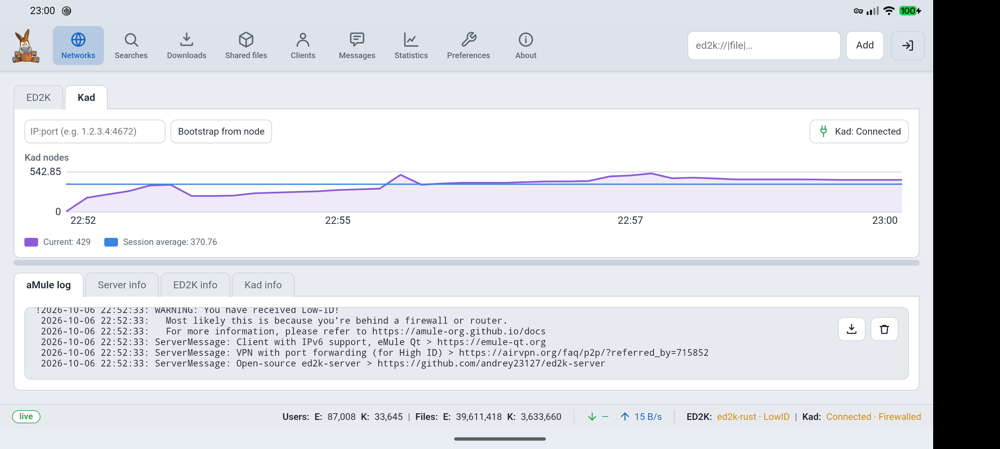
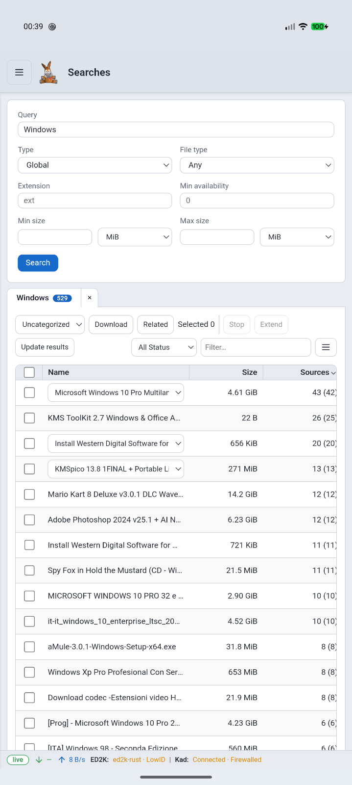
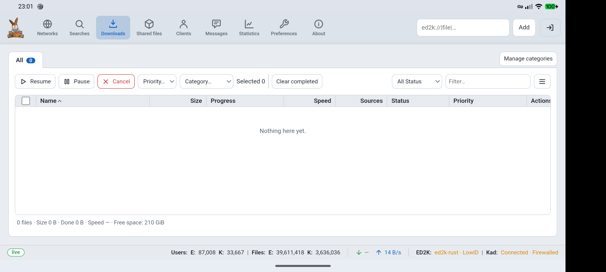
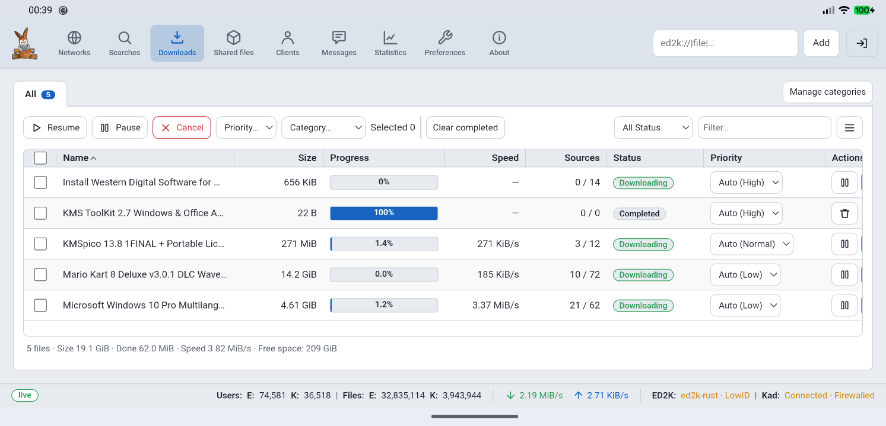
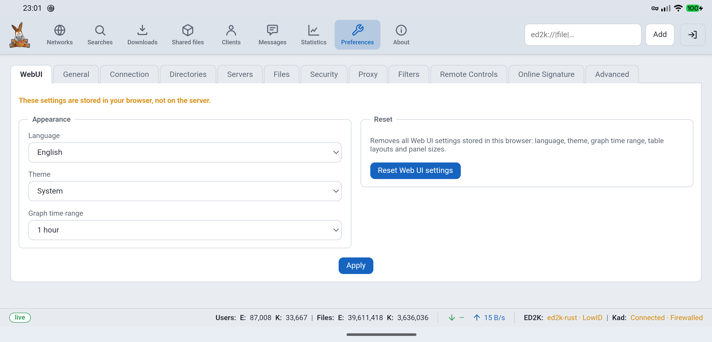

# aMule for Android (preview)

An Android package that runs aMule's native daemon on the phone and presents aMule's responsive web interface in an Android WebView. This is an early, working prototype intended for hands-on review.

| Item | Current status |
|---|---|
| Android app | Version 0.1.3, debug build |
| Supported ABI | `arm64-v8a` only |
| Minimum Android API | 33 (Android 13) |
| Target Android API | 36 (Android 16) |
| Interface | aMule Web UI inside an Android WebView |
| aMule core | Android ARM64 `amuled` and `amuleapi` binaries included |
| Tested device | Pixel 10 Pro XL, ARM64, GrapheneOS (Android 17 / API 37) |

## Screenshots

Captured from the running app on the tested phone in landscape and portrait orientations.

### Networks — Kad



### Searches



### Downloads



### Active downloads



### Preferences — Web UI



## How the app works

The Android wrapper starts two native aMule programs as child processes:

1. `amuled` runs the eD2k/Kad client and stores its configuration and working files in the app's private storage.
2. `amuleapi` serves the bundled aMule Web UI and its REST API on `127.0.0.1:4713`. The wrapper connects the WebView to this local address and creates a local authenticated session.

Both programs run under an Android foreground service. Android displays a persistent notification while the service is active; its **Stop** action terminates the API and daemon. The service monitors the child processes and local API listener: it restarts a failed API process without restarting a healthy daemon, and retries the core if the daemon exits, using a growing delay after repeated failures. The notification reports network availability and low-storage warnings. The Web API is configured for loopback access, rather than a LAN listener. When saved aMule preferences enable UPnP, the service holds Android's Wi-Fi multicast lock so pupnp can receive SSDP discovery packets; the lock is released when the service stops.

The WebView talks to the local API over HTTP on `127.0.0.1`; the Android manifest permits cleartext traffic for this local connection. The API itself is configured to listen only on loopback.

aMule's configuration, incomplete files (`Temp`) and active downloads live in app-private storage. When a download completes, the app publishes and verifies it in the shared `Downloads/aMule/Complete/` folder, adds that folder to aMule's shared directories, then removes the private original and refreshes aMule's share list. The private and shared copies coexist only during the transfer; if publishing or sharing the destination fails, the original is kept.

The app packages the responsive aMule Web UI with small mobile layout and chart-label adjustments. The phone displays it in a WebView.

The included core build enables aMule's UPnP port mapping, which is off by default in aMule preferences and can be enabled under **Preferences → Connection**. Restart the app after changing that option; aMule initializes its UPnP control point when the daemon starts. It maps the P2P TCP and UDP ports through a compatible local router; it does not map the loopback-only Web API or External Connections port. IPv6 remains disabled because the pinned aMule source labels IPv6 TCP admission experimental and says IPv6 identity handling is incomplete. IP geolocation, experimental uTP, QUIC and native gettext catalogs also remain disabled; the Web UI has its own bundled translations.

## What works in this preview

- Starts and stops the native daemon and Web API from the Android app.
- Keeps the daemon running in the foreground service when the screen is closed.
- Reports network availability in the foreground notification and recovers the API or daemon if either child process exits unexpectedly.
- Checks free space on the aMule data volume once a minute and warns in the notification below 1 GiB free; it does not stop or delete downloads.
- Shows the Web UI areas available in aMule's web client: Networks, Searches, Downloads, Shared files, Clients, Messages, Statistics, Preferences and About.
- Uses the aMule Web UI for configuration; settings shown there are those implemented by the Web API.
- Includes native UPnP support for mapping aMule's P2P TCP and UDP ports on compatible LAN routers. Router discovery and mapping have been tested on the device.
- Moves completed files from aMule's private Incoming directory to `Downloads/aMule/Complete/` on supported Android versions (API 33 and later), then keeps that folder in aMule's shared-directory list so completed files remain available for sharing.
- Includes tested layout adjustments for short landscape screens and Kad graph labels.

UPnP requires a compatible router with IGD enabled and reachable over the local network; mapping behaviour may vary between routers.

## Build and install the Android app

The Android ARM64 aMule executables are included in this repository under `app/src/main/jniLibs/arm64-v8a/`. Building the APK packages those binaries; it does not rebuild the aMule native core.

### Ready-made testing build

Download a preview APK from [GitHub Releases](https://github.com/XG-DL/amule-android-preview/releases). The APK is a debug-signed development build for testing. Android may ask you to allow installation from the app used to open the download. The release notes include the APK's SHA-256 checksum.

### Requirements

- JDK 17 or newer.
- Android SDK Platform 36, Android Build Tools and NDK `28.2.13676358` installed.
- Gradle is provided by the checked-in wrapper (`./gradlew`); no system Gradle or CMake is needed. This APK build does not compile native code. NDK `28.2.13676358` is pinned so Gradle can strip debug symbols from the included executables with the same NDK generation used to build them.
- Android SDK location available through `ANDROID_HOME`/`ANDROID_SDK_ROOT` or a local, untracked `local.properties` file.

### Build

From the repository root:

```sh
./gradlew assembleDebug
```

The APK is written to `app/build/outputs/apk/debug/app-debug.apk`.

### Install on a connected ARM64 Android device

Enable Android developer options and USB debugging, connect the device, then run:

```sh
adb install -r app/build/outputs/apk/debug/app-debug.apk
adb shell monkey -p uk.xgdl.amuleprobe 1
```

Allow notifications when Android asks. The notification is how Android indicates the transfer service is active and provides the Stop action.

## Native aMule source and rebuilding the core

The included native executables were built from aMule commit [`f1d4b19ed01d07c6509d2d751219e4a1405c661c`](https://github.com/amule-org/amule/commit/f1d4b19ed01d07c6509d2d751219e4a1405c661c), plus the Android and Web UI patch in [native-core/android-core.patch](native-core/android-core.patch). The patch changes Android argument and password handling, Android certificate bundle setup, the Android-compatible static UPnP target, and the mobile Web UI layout and graph labels. [native-core/README.md](native-core/README.md) records the native build inputs and binary identifiers.

Rebuilding the APK is a single Gradle command above. Rebuilding the native executables is a separate cross-compilation step. [native-core/build-android-deps.sh](native-core/build-android-deps.sh) downloads SHA-256-pinned archives and builds wxWidgets, Boost headers, Crypto++, curl, OpenSSL and pupnp/libupnp for ARM64 Android, then builds the aMule binaries. It requires Linux x86-64, Android NDK `28.2.13676358`, CMake 3.28.3 or newer, and the patched source checkout described in [native-core/README.md](native-core/README.md). The script keeps third-party sources and generated files outside the tracked project files under `native-core/.android-deps/`; it does not replace the packaged binaries automatically.

## Testing record

Manual smoke testing was performed on one ARM64 GrapheneOS phone on 7 October 2026. aMule discovered the local router's UPnP WAN service, added three P2P mappings, reached eD2k High ID and connected Kad without a firewall warning. A live port change and restoration also retained High ID. See [TESTING.md](TESTING.md) for the steps and remaining coverage limits.

Run `scripts/android-smoke-test.sh` with one authorised Android device connected to check the foreground service, daemon, local API and its download/shared-file endpoints. The script uses Python 3 and the debug APK's `run-as` access; it opens a temporary ADB forward to the loopback-only API and removes it when finished. Set `AMULE_EXPECT_SHARED` to a filename fragment to check that a particular completed test file appears in the shared list.

## Known limits

- ARM64 only. Other device architectures have no bundled native binaries.
- Tested on one GrapheneOS phone, not a range of Android versions or manufacturers.
- No automated Android UI test suite is included; interaction testing to date is manual.
- A ten-minute screen-off interval, a brief full-network interruption, an app stop/relaunch and a device reboot have been checked on one phone. aMule does not auto-start at boot; the user must open it after reboot. Android process reclamation, battery-saver behaviour, extended transfers and all preference effects have not been verified.
- The native dependency and aMule cross-build is automated for Linux x86-64 by `native-core/build-android-deps.sh`. It is separate from the Android wrapper/APK build and has not yet been exercised on other host operating systems or architectures.

## Licensing and project status

The Android wrapper and Android-specific aMule changes are released under GPL-2.0-or-later; see [LICENSE.md](LICENSE.md). The included native binaries are built from the pinned aMule source and patch noted above. [THIRD-PARTY-NOTICES.md](THIRD-PARTY-NOTICES.md) identifies their bundled dependencies and licence terms. The Web UI also retains the Preact and htm notices alongside the vendored files under `app/src/main/assets/webui/js/vendor/`.

The app is available for testing and review.
