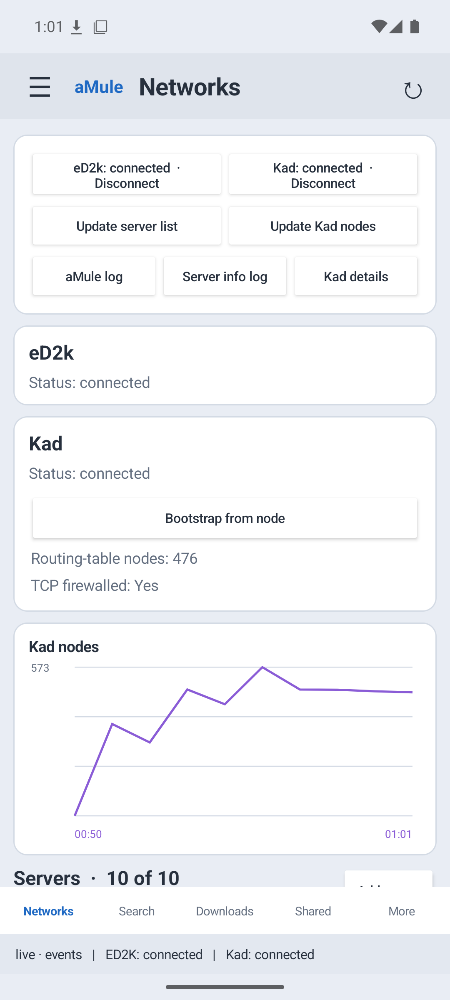
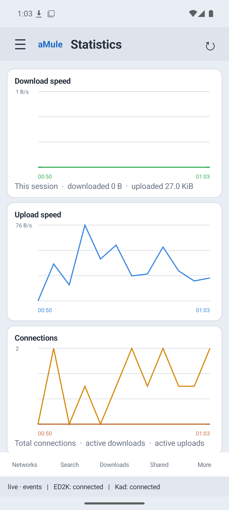
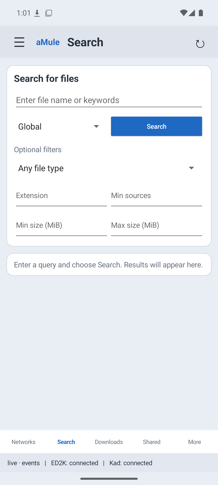
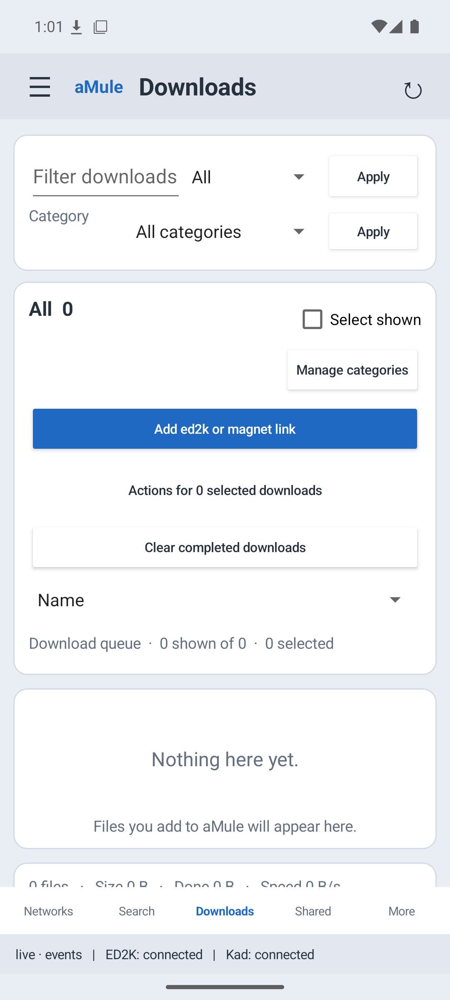
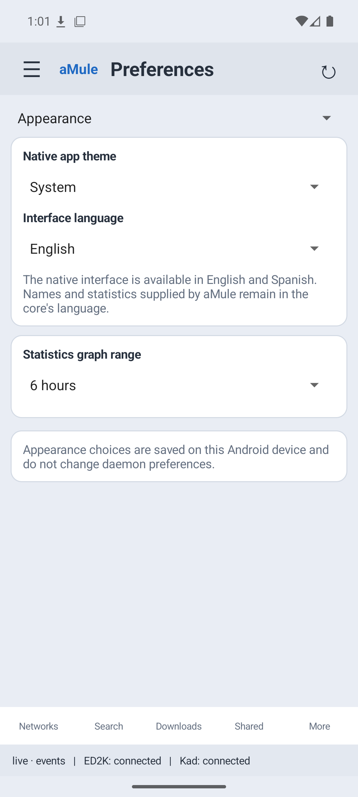
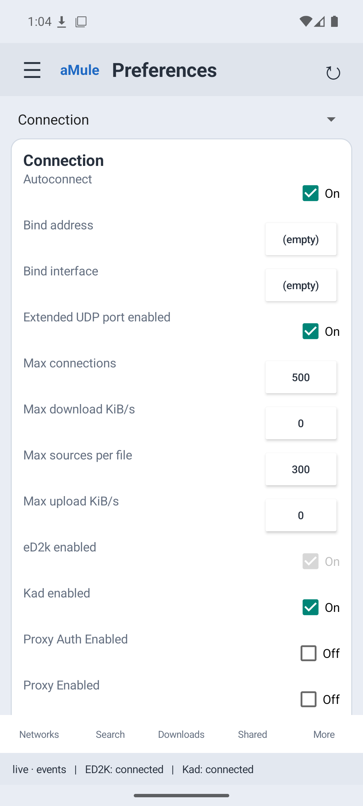

# aMule for Android — native interface preview

This branch is the first public preview of a native Android interface for the [aMule for Android project](https://github.com/XG-DL/amule-android-preview). It runs the same bundled `amuled` daemon and `amuleapi` service as the existing WebView app. The native screens use the local API to monitor and control aMule; the full Web UI remains available from the app menu.

The interface offers **English and Spanish** and is designed for a phone screen.

| Item | Current status |
|---|---|
| Android app | Version 0.1.3, debug build |
| Bundled native binaries | ARM64 (`arm64-v8a`) `amuled` and `amuleapi` |
| Minimum Android version | Android 13 / API 33 |
| Target Android version | Android 16 / API 36 |
| Native interface review | Android 16 / API 36 x86_64 emulator running the ARM64 binaries through Android's ARM translation layer |
| Physical device review | The existing WebView app was checked on a Pixel 10 Pro XL running GrapheneOS; the native interface still needs a physical ARM64 review |

## Native interface

- **Networks:** eD2k and Kad connection controls, server management, Kad details and graphs, and aMule and server logs.
- **Search:** Global, Kad and Local searches, filters, result sorting and per-search state.
- **Downloads:** filters, categories, sorting, selection, pause and resume, priority changes, cancellation and file details.
- **Shared files:** filters, upload priority, metadata refresh, verification and file details.
- **Clients and messages:** connected and known client views, client details, friends and conversations.
- **Statistics:** transfer, connection and Kad graphs, session totals and a statistics tree.
- **Preferences and About:** editable settings exposed by the API, appearance and language choices, version information and update checks.

The native screens refresh from the API's event stream, with polling for reconciliation. Appearance choices are stored on the Android device. The other editable preferences are sent to the running aMule daemon. See the [native interface review record](NATIVE-UI-EXPERIMENT.md) for the controls exercised and current feature differences.

## Screenshots

These are screenshots of the **native Android interface**, captured in English on the Android 16 emulator. Search and Downloads show their empty states after temporary test downloads were removed.

| Networks and Kad | Statistics |
|---|---|
|  |  |

| Search | Downloads |
|---|---|
|  |  |

| Appearance | Connection preferences |
|---|---|
|  |  |

The [main branch](https://github.com/XG-DL/amule-android-preview/tree/main) documents the earlier WebView interface and has its own screenshots.

## How it works

The Android foreground service starts `amuled` for eD2k/Kad and `amuleapi` for the REST API and Web UI. The native screens connect to `amuleapi` on `127.0.0.1:4713`. The service keeps a notification visible while aMule runs, reports network and low-storage status, and can recover either child process if it exits unexpectedly. The Web UI opens in a WebView from the native app menu and connects to the same loopback service.

aMule's configuration and incomplete files live in the app's private storage. Completed downloads are published to `Downloads/aMule/Complete/`, added to aMule's shared directories, and removed from the private Incoming directory after the published copy is verified. The underlying daemon and its Android-specific patches are shared with the WebView version of this project.

The bundled aMule core includes local-router UPnP port mapping. It is off by default in aMule preferences and requires a compatible router. The core build currently leaves IPv6, IP geolocation, experimental uTP, QUIC and native gettext catalogs disabled; the native Android interface has its own English and Spanish strings.

## Build and install

Download the [native interface preview APK](https://github.com/XG-DL/amule-android-preview/releases/tag/v0.1.3-native-preview), or build this branch from source. The [Web UI preview APK](https://github.com/XG-DL/amule-android-preview/releases/tag/v0.1.3-webview-preview) is built from `main`. Both use the same Android application ID, so installing one replaces the other. Building either APK packages the included ARM64 executables; it does not recompile the aMule core.

You need JDK 17 or newer, Android SDK Platform 36, Android Build Tools and NDK `28.2.13676358`. Make the SDK available through `ANDROID_HOME` or `local.properties`, then run:

```sh
./gradlew assembleDebug
```

The APK is written to `app/build/outputs/apk/debug/app-debug.apk`. To install and launch it on a connected ARM64 Android device with USB debugging enabled:

```sh
adb install -r app/build/outputs/apk/debug/app-debug.apk
adb shell monkey -p uk.xgdl.amuleprobe 1
```

The included native binaries were built from [aMule commit `f1d4b19`](https://github.com/amule-org/amule/commit/f1d4b19ed01d07c6509d2d751219e4a1405c661c) plus [the Android core patch](native-core/android-core.patch). The separate [native-core build guide](native-core/README.md) and [dependency build script](native-core/build-android-deps.sh) document how to reproduce those binaries.

## Review status

The native interface was built and manually exercised on an Android 16 / API 36 x86_64 emulator, where Android translated the bundled ARM64 binaries. The review covered live network status, an active test download, shared-file details, client views, graphs, representative preference edits, navigation and the English and Spanish interfaces. Temporary test files and edits were removed or restored. The [detailed review record](NATIVE-UI-EXPERIMENT.md#review-state) lists what was checked.

CI also opens the packaged native app on that emulator, visits every main screen through its menu in English and Spanish, and changes the language through Preferences in both directions. This is a navigation and language smoke check; it does not submit network actions or change daemon preferences.

Development continues on remaining feature differences and physical ARM64 device testing. The Web UI remains available for workflows not yet represented in the native screens. The [existing Android core test record](TESTING.md) covers the earlier physical phone checks of the daemon, service, UPnP and WebView.

## Licence

The Android wrapper and Android-specific aMule changes are released under GPL-2.0-or-later; see [LICENSE.md](LICENSE.md). [THIRD-PARTY-NOTICES.md](THIRD-PARTY-NOTICES.md) lists bundled dependencies and their licences.
